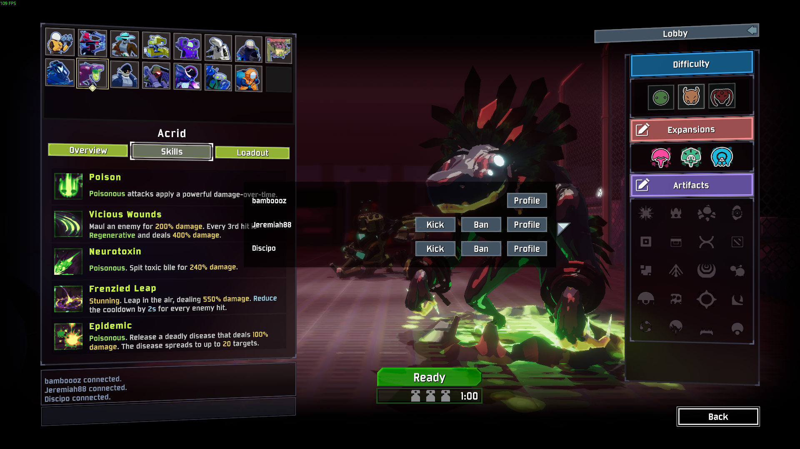

# KickMenu
A Risk of Rain 2 mod for lobby management. Open the menu using F1.

KickMenu allows you to:
- Kick players
- Ban players
- View the Steam profile of players in your lobby (no support of Epic Games)
- Change whether kicking / banning should be confirmed by a popup menu
- Change whether kicking / banning should send a chat message
- Change the keybinds for opening the menu

